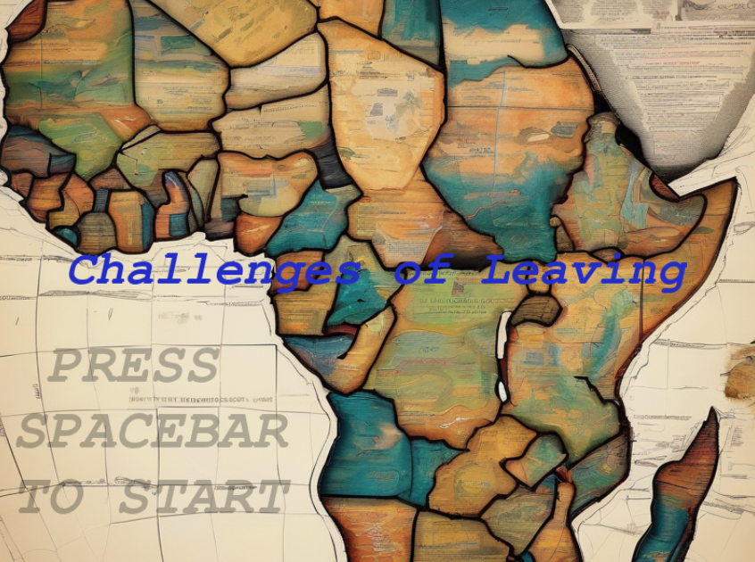
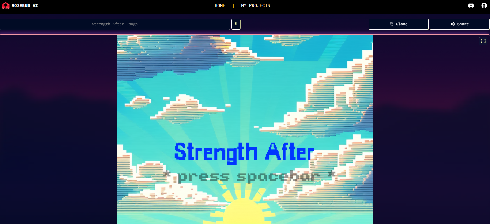

# README AND GAME IN PROGRESS

# Strength after
Aimed at ages 18-25, the 1-2 minute game offers a quick look into the life of a celebrity refugee. The game allows the player to help the refugee.

## Link to deployed page: 
https://vickysug.github.io/strength-after/

Screenshot of start screen

## End mission:

## Link to my storyborad on Canva: 

## Project Brief

## Technologies used

For the project the aim was to use AI, mainly Rosebud AI (https://play.rosebud.ai/home)

I chose to use a game called Strength After, Evolved from: Strength After Rough

On the platform a developer can clone games created by other developers and change them for their own purpose. 

